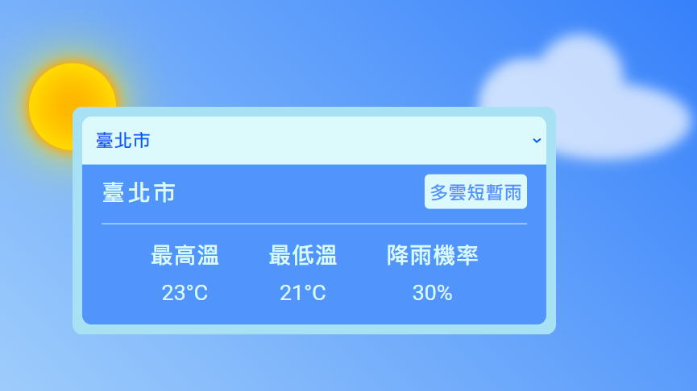

# Taiwan Weather

[demo](https://littleplumule.github.io/taiwan-weather/)

## Description
串接[氣象資料開放平台](https://opendata.cwb.gov.tw/index) API 取得台灣地區的天氣資訊

## Clone
`git clone https://github.com/littlePlumule/taiwan-weather.git`

`cd taiwan-weather`

`npm install`

## Environment

`VITE_WEATHERS`

## Preview
`npm run dev`
